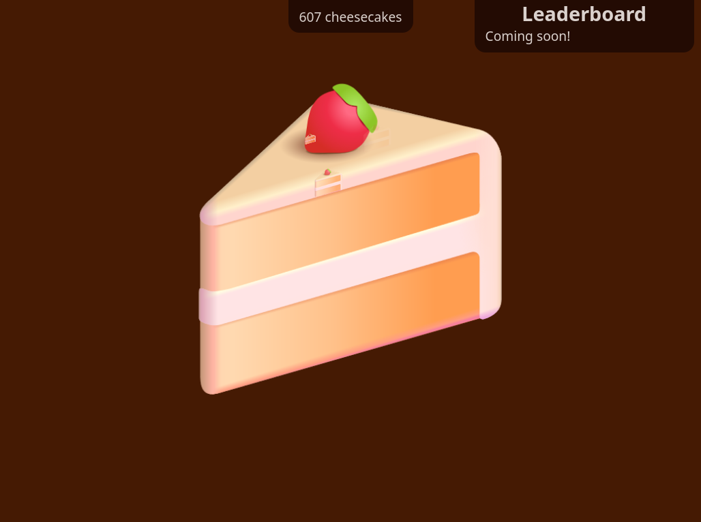

# 🍰 Cheesecake clicker

> A clicker game inspired by our favourite dessert

💻 **Check it out: [cheesecake-clicker.pages.dev](https://cheesecake-clicker.pages.dev/)**

## Project motivation

Clicker games are pretty fun, and I wanted to use my web development skills to make my own one from scratch.

My friends wanted a leaderboard, so I decided to learn to use ✨ Airtable ✨ and Cloudflare Workers to create a leaderboard system. This isn't ready, but you can take a look at the middleware code in my [`cheesecake-worker`](https://github.com/MMK21Hub/cheesecake-worker) repository.

## Features

- Big cheesecake, _and_ little cheesecakes!
- Persistent cheesecake counter
- Mobile support (dodgy but functional)
- Keyboard support (with `Tab` and `Enter`)

## Future plans

- A friendly leaderboard for sharing stats
  - Private leaderboards, if required
- Ingredients-based cheesecake creation

## Tech stack

Cheesecake Clicker uses **[✌️ Voby](https://github.com/vobyjs/voby)** as its JavaScript framework, because it's lightweight, performant, and supports JSX. It's styled with plain CSS files, with a mixture of utility classes and component-specific styles.
