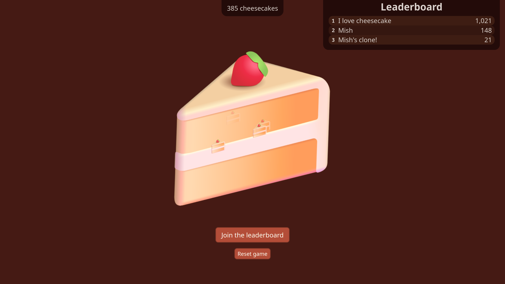

# 🍰 Cheesecake clicker

> A clicker game inspired by our favourite dessert

🎮 **Play it at [cheesecake-clicker.pages.dev](https://cheesecake-clicker.pages.dev/)**

## Project motivation

Clicker games are pretty fun, and I wanted to use my web development skills to make my own one from scratch.

My friends wanted a leaderboard, so I decided to learn to use ✨ Airtable ✨ and Cloudflare Workers to create a leaderboard system. The middleware code is in in my [`cheesecake-worker`](https://github.com/MMK21Hub/cheesecake-worker) repository.

## Features

- Big cheesecake, _and_ little cheesecakes!
- Persistent cheesecake counter
- Responsive (but doesn't _quite_ fit on mobiles at the moment)
- Keyboard support (try out `Tab` and `Enter`)
- A global leaderboard (pls don't abuse :3)

## Future plans

- Ingredients-based cheesecake creation

## Tech stack

Cheesecake Clicker uses **[✌️ Voby](https://github.com/vobyjs/voby)** as its JavaScript framework, because it's lightweight, performant, and supports JSX. It's styled with plain CSS files, with a mixture of utility classes and component-specific styles.
